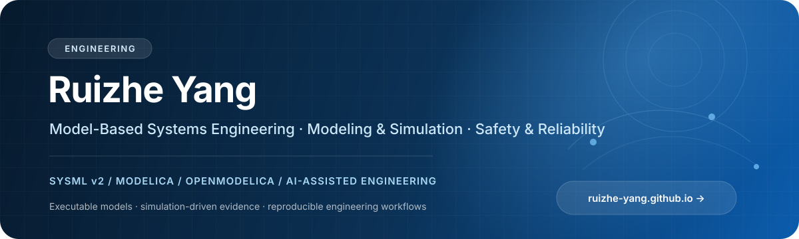

  

<a href="https://ruizhe-yang.github.io/">Personal Website</a>
&nbsp;&nbsp;·&nbsp;&nbsp;
<a href="https://github.com/Ruizhe-Yang?tab=repositories">Repositories</a>

---

## Current focus

> Building model-driven and simulation-driven engineering workflows that connect **system architecture, executable models, and safety evidence**.

## Selected open source

| Project | Focus |
| :--- | :--- |
| **[OneSatSim](https://github.com/Ruizhe-Yang/OneSatSim)** | One-stop Modelica framework for system-level satellite modeling, multi-domain mission simulation, configurable design, and secondary development. |
| **[modelica-system-level-simulation-skill](https://github.com/Ruizhe-Yang/modelica-system-level-simulation-skill)** | OpenModelica-first Agent Skill for system-level modeling, diagnosis, visualization, validation, and optimization. |
| **[SafetyAssessmentLibrary](https://github.com/Ruizhe-Yang/SafetyAssessmentLibrary)** | Reusable Modelica assets for independent, simulation-driven dynamic safety assessment. |
| **[FaultReplacementLibrary](https://github.com/Ruizhe-Yang/FaultReplacementLibrary)** | Non-intrusive, component-replacement-based fault injection and fault-effect simulation. |
